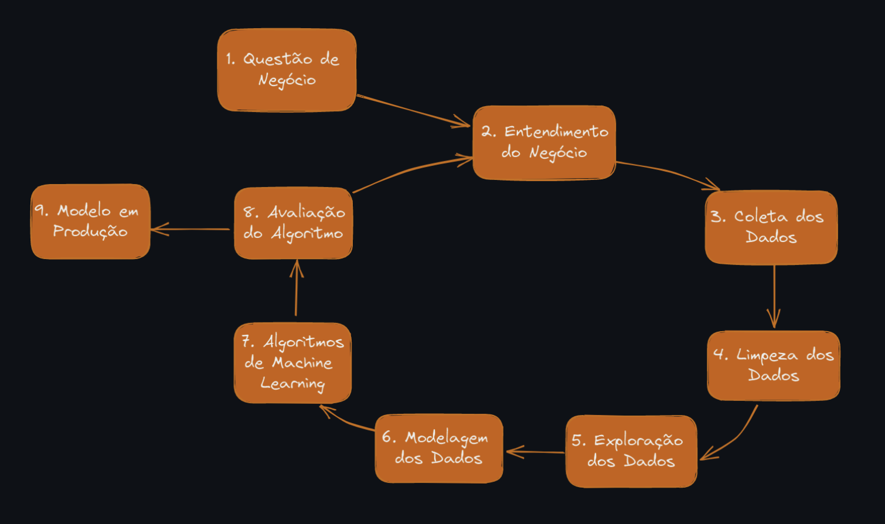
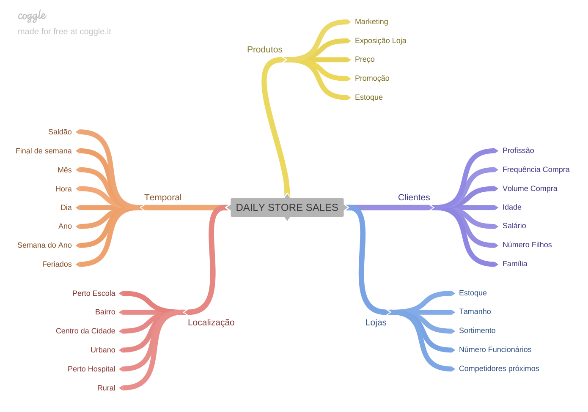
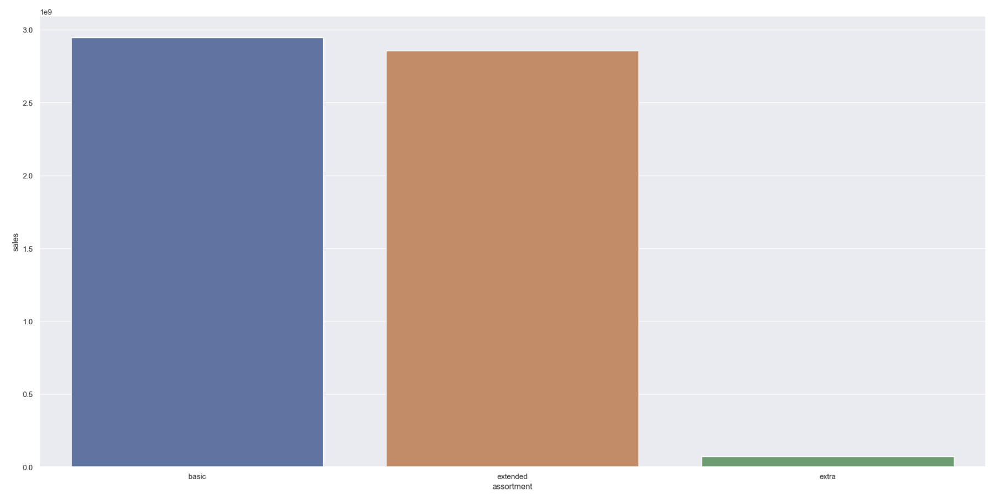
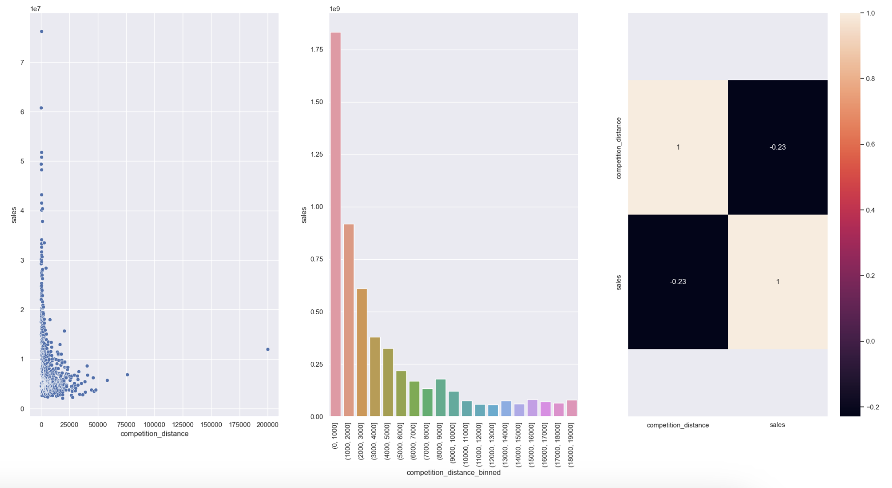
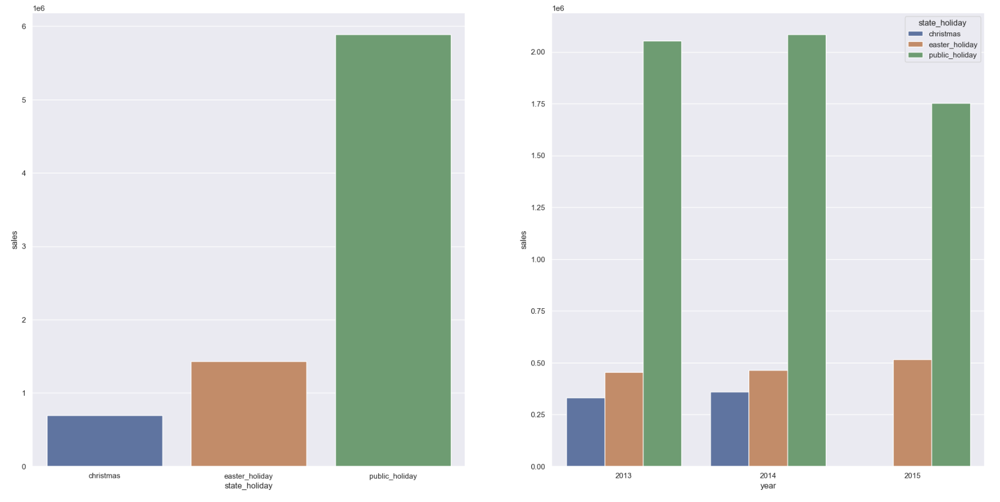
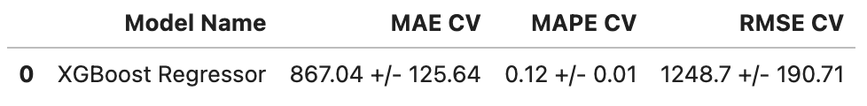
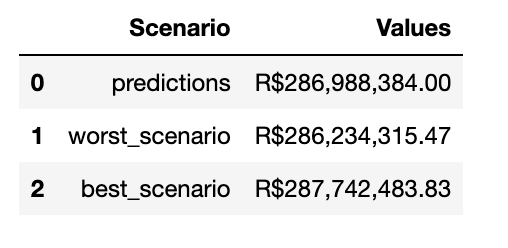

# Sales Forecast 💵 - Rossmann Pharmacies 

Rossmann is a German pharmacy chain that operates more than 3,000 drugstores in 7 European countries and around 56,000 employees.

The company made its data available within the data competitions platform [Kaggle](https://www.kaggle.com/competitions/rossmann-store-sales/overview). 1,017,209 records of sales made by the company's branches were made available, containing 18 unique characteristics for each sale made.

# 1.0 Business Problem
The CFO has the need to renovate the stores of the pharmacy chain, to improve the structure of the stores and better serve the public. To do so, he needs the store managers to send the revenue forecast for the next 6 weeks so that he can provision the amount that will be invested by each store in the renovation process.

Currently, these values ​​are calculated individually, and each manager delivers this forecast. As each store has different factors that influence its results, such as promotions, competitions for customers, holidays, seasonality, etc., and the calculations are done manually, the results vary a lot.

In this way, the idea of ​​this project is to assist the CFO in decision making, providing forecast results for each store automatically, and enabling the CFO to consult forecasts through a Telegram application bot.

# 2.0 Business Assumptions
For the construction of the solution, the following assumptions were considered:
* The sales forecast consultation will be available 24/7, and will be accessible via the Telegram application, where the CFO will enter the store code, and in response, he will receive the forecast value for the next 6 weeks.
* Only stores that had a sales value greater than 0 in the database were considered for the forecast.
* The days when the stores were closed were excluded from the forecast.
* Stores that did not have data on nearby competitors had the distance value fixed at 200,000 meters.
## 2.1. Descrição dos Dados

| Atributos                          | Descrição                                                                                                                                             |
| :-------------------------------- | :---------------------------------------------------------------------------------------------------------------------------------------------------- |
| store                             | Unique identifier for each store |
| date | Date on which the sale event occurred |
| day_of_week | Numeric variable that represents the day of the week |
| sales | Day's sales value |
| customers | Number of customers in the store on the day |
| open | Indicator for store open = 1 or closed = 0 |
| state_holiday | Indicates whether the day is a state holiday. a = Public holiday, b = Easter holiday, c = Christmas, 0 = No holiday |
| school_holiday                     | Indicates whether or not the store was closed during the school holiday |
| store_type | Indicates the model of stores. Can vary between a, b, c, d |
| assortment | Indicates the level of product variety: a = basic, b = extra, c = extended |
| competition_distance | Distance (in metres) to nearest competitor |
| competition_open_since [Month/Year] | Indicates the year and month in which the nearest competitor opened |
| promo | Indicates if the store has an active promotion on the day |
| promo_2                            | Indicates whether the store continued the promotion: 0 = store not participating, 1 = store participating |
| promo_2_since [Year/Week] | Describes the year and week when the store starts the extended promotion |
| promo_interval | Describes the months in which the store started the promo2. For example, "Feb,May,Aug,Nov" means that the store started the extended promotions in each of these months |

# 3.0 Solution Strategy

The strategy uses the CRISP-DS method, which consists of 9 cyclical steps, where at each iteration of the nine steps, the business result is being improved, aiming for increasingly faster deliveries and increasingly more quality and accuracy, thus enabling the teams that will use the developed results have a product that is minimally usable in the first delivery and that is perfected over time.

# 4.0 Insights

## 4.1 Mind Map

## 4.2 Top 3 Insights

Hypothesis 01: Stores with larger assortments should sell more

FALSE. Stores with larger assortments sell less

Hypothesis 02: Stores with closer competitors should sell less

FALSE. Stores with closer competitors sell more

Hypothesis 03: Stores open during the Christmas holiday should sell more

FALSE. Stores open during the Christmas holiday sell less

From the deep analysis of these hypotheses made through Exploratory Data Analysis (EDA), it is possible to:
- Gain business experience
- Generate important insights for the company
- Find important variables for the model

# 5.0 Machine Learning
To forecast sales, 5 Machine Learning algorithms were used:

- Average Model
- Linear Regression
- Linear Regression Regularized
- Random Forest Regressor
- XGBoost Regressor

After testing the selected algorithms, the Cross Validation technique was used to validate the results and ensure the actual performance of each of the models used. As the problem was a time series, the Cross Validation technique specific to this problem was used, thus respecting the timeline in the training of algorithms.

In addition, the Boruta feature selection method was used to help choose the most important and impactful features in the database.

After training the models on the training data and having done the Cross-Validation, as well as analyzing the error through MAE, MAPE and RMSE, I chose to use XGBoost Regressor.

Error results:

# 6.0 Bot Telegram

From a bot created in the Telegram application, it is possible to quickly and conveniently consult the business values ​​of each Rossmann store.

# 7.0 Business results

As shown in the image, the estimated sale value is BRL 286,988,384.00, which can vary between BRL 287,742,483.83 ( Best case scenario ) and BRL 286,234,315.47 ( Worst case scenario ).

# 8.0 Conclusions
As can be seen, the project solved the initial problem, which was the forecast of stores' billing done manually by their managers.

Another important point to highlight is that with the solution created, the CFO can now automatically consult the stores using the created BOT, providing more agility in decision making.

# 9.0 Lessons Learned
- Prioritize tasks and solutions
- Develop solutions in a cyclical way, thus delivering results faster
- Construction of a BOT for the Telegram messaging application, in order to speed up access to information

# 10.0 Next Steps
- Investigate why some stores have bad forecasts
- Select other algorithms for training in the next cycle, in order to seek a solution that improves forecasting performance
- Create a web application using the Streamlit framework to give web access to forecasts for store managers.
- Implement unit tests in the produced classes and functions.
- Create new Features to try to improve the performance of the current model and future models.
- Apply programming techniques to improve the performance of the created solution.
